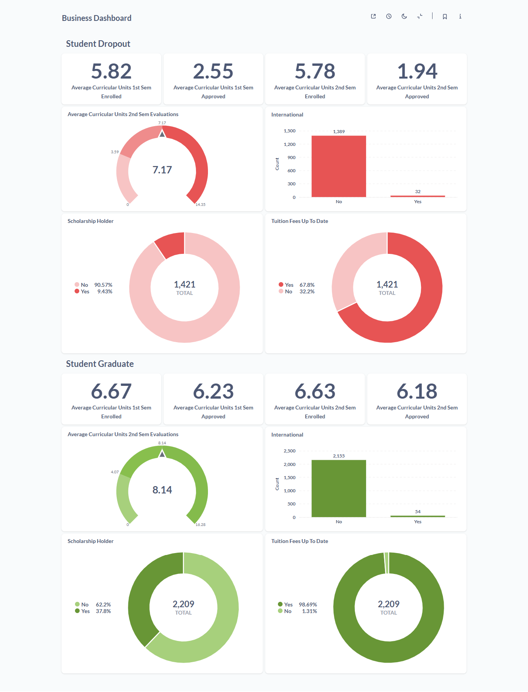

# Proyek Akhir: Menyelesaikan Permasalahan Perusahaan Edutech

## Business Understanding
Jaya Jaya Institut merupakan salah satu institusi pendidikan tinggi yang telah berdiri sejak tahun 2000. Sejak awal berdirinya, institusi ini telah mencetak banyak lulusan berkualitas yang berkontribusi positif di berbagai bidang, sehingga membangun reputasi yang sangat baik di dunia pendidikan. Namun demikian, di balik capaian tersebut, masih terdapat permasalahan signifikan yang dihadapi, yaitu tingginya angka siswa yang tidak menyelesaikan pendidikannya atau mengalami putus studi (dropout).

Fenomena dropout ini menjadi tantangan serius bagi institusi pendidikan karena tidak hanya mempengaruhi citra akademik, tetapi juga mencerminkan adanya ketidakefektifan dalam proses pembelajaran dan bimbingan siswa. Jika tidak ditangani dengan baik, hal ini dapat berdampak pada rendahnya angka kelulusan dan menurunnya kualitas pendidikan secara keseluruhan.

Menyadari pentingnya isu ini, Jaya Jaya Institut berupaya untuk melakukan deteksi dini terhadap siswa yang memiliki potensi untuk mengalami dropout. Deteksi ini diharapkan dapat menjadi langkah preventif sehingga siswa yang terindikasi dapat segera mendapatkan perhatian dan bimbingan khusus, baik secara akademik maupun non-akademik, guna meningkatkan peluang mereka untuk menyelesaikan studi tepat waktu.

Untuk mendukung upaya ini, diperlukan pemanfaatan teknologi dan analisis data guna mengidentifikasi pola dan faktor-faktor yang mempengaruhi potensi dropout. Oleh karena itu, Jaya Jaya Institut menggandeng calon data scientist untuk membantu menganalisis data performa siswa serta mengembangkan sistem pemantauan berupa dashboard yang dapat digunakan oleh pihak institusi untuk memahami kondisi siswa secara menyeluruh dan mengambil tindakan yang tepat secara lebih cepat dan efisien.

### Permasalahan Bisnis
1. **Tingginya Angka Dropout Mahasiswa**  
   Meskipun Jaya Jaya Institut memiliki reputasi yang baik dan telah mencetak banyak lulusan berkualitas, institusi ini menghadapi permasalahan serius yaitu tingginya jumlah siswa yang tidak menyelesaikan pendidikan mereka (dropout). Tingginya angka dropout ini tidak hanya mencoreng citra institusi, tetapi juga berdampak pada efektivitas sistem pendidikan dan kualitas lulusan.
2. **Tidak Tersedianya Sistem Deteksi Dini untuk Siswa Berisiko Dropout**  
   Saat ini, Jaya Jaya Institut belum memiliki sistem yang mampu secara cepat dan akurat mengidentifikasi siswa yang berpotensi mengalami dropout. Tanpa sistem ini, pihak institusi kesulitan untuk memberikan bimbingan atau intervensi yang tepat waktu kepada siswa yang membutuhkan.
3. **Kesulitan dalam Memahami dan Memantau Performa Siswa**  
   Institusi mengalami tantangan dalam mengelola dan menganalisis data performa siswa secara efektif. Tanpa alat bantu visual atau sistem monitoring yang terstruktur, pihak pengajar dan manajemen kesulitan dalam menilai kondisi akademik siswa secara keseluruhan dan mengambil keputusan berbasis data.
4. **Kebutuhan Akan Dashboard yang Informatif dan Mudah Digunakan**  
   Untuk membantu proses pemantauan performa siswa serta mendukung pengambilan keputusan, Jaya Jaya Institut memerlukan sebuah dashboard interaktif yang dapat menyajikan informasi penting secara visual, ringkas, dan mudah dipahami oleh pihak akademik dan manajemen.


### Cakupan Proyek
#### 1. Prediksi Dropout Siswa dengan Machine Learning
Membangun model untuk memprediksi apakah seorang siswa berisiko mengalami dropout, graduate, atau enrolled, serta melakukan deployment secara online menggunakan Streamlit.

#### 2. Analisis Faktor Dropout dengan Dashboard Metabase
Membuat dashboard interaktif untuk menganalisis faktor-faktor yang memengaruhi kemungkinan siswa dropout dan siswa graduate.

### Persiapan
Sumber data: 
[](https://github.com/dicodingacademy/dicoding_dataset/blob/main/students_performance/data.csv)

Setup environment:
- Buka terminal WSL ubuntu
- Pastikan sudah menginstall anaconda atau miniconda.
- Buat virtual environment dengan perintah:
    ```
    conda create -n penerapan_ds python=3.10
    ```
- Aktifkan dengan perintah: 
    ```
    conda activate penerapan_ds
    ```
- Install beberapa library yang akan digunakan seperti:
    ```
    pip install pandas
    pip install scikit-learn
    pip install streamlit
    dan lainnya
    ```

## Business Dashboard
Sebelum membuat dashboard, cari feature yang paling berpengaruh terhadap label. Pencarian tersebut menggunakan model Gradient Boosting yang sebelumnya telah dibuat, berikut hasilnya:

   

Dari feature yang paling relevan tersebut, akan dipilih beberapa yang teratas dan akan dilakukan analisis yang lebih lanjut. Analisis tersebut dilakukan menggunakan tool metabase sebagai tempat untuk membuat business dashboard. Analisis dilakukan hanya sebatas untuk siswa yang dropout. Berikut business dashboard tersebut.

   

Dari dashboard tersebut, dapat diketahui bahwa:

Siswa yang mengalami dropout menunjukkan pola kesulitan akademik dan tantangan finansial yang konsisten. Pada semester pertama, mereka rata-rata mengambil 5,82 unit kurikuler, namun hanya 2,55 unit yang berhasil diselesaikan. Kondisi ini memburuk pada semester kedua, di mana rata-rata unit yang diambil tetap tinggi (5,78 unit), tetapi hanya 1,94 unit yang lulus, menunjukkan adanya penurunan performa akademik yang signifikan.

Sebagai perbandingan, siswa yang lulus menunjukkan performa akademik yang lebih stabil, dengan rata-rata 6,67 unit terdaftar dan 6,23 unit diselesaikan di semester pertama, serta 6,63 unit terdaftar dan 6,18 unit diselesaikan di semester kedua. Evaluasi semester kedua mereka menunjukkan rata-rata nilai 8,14 dari skala maksimal 16,28, yang mencerminkan kemampuan menyerap materi pembelajaran yang cukup stabil namun masih memiliki ruang untuk perbaikan.

Lebih lanjut, performa akademik dalam evaluasi semester kedua siswa dropout tergolong sedang, dengan rata-rata nilai 7,17 dari skala maksimal 14,35, yang dapat mengindikasikan adanya kendala dalam menyerap materi pembelajaran. Selain itu, rendahnya persentase siswa dropout yang menyelesaikan unit yang disetujui dibandingkan yang terdaftar menunjukkan potensi masalah dalam pengelolaan waktu, motivasi, atau dukungan akademik.

Dari sisi latar belakang, sebagian besar siswa, baik yang dropout maupun yang lulus, merupakan penduduk lokal, dengan hanya 2,3% siswa internasional di kelompok dropout dan sedikit lebih tinggi (sekitar 1,6%) di kelompok lulus, sehingga faktor budaya atau bahasa mungkin tidak menjadi pengaruh utama. Selain itu, mayoritas siswa dropout tidak menerima beasiswa (90,57%), sementara di kelompok lulus, persentase penerima beasiswa lebih tinggi (37,8%), menunjukkan dukungan finansial yang lebih baik. Hal ini didukung oleh data bahwa 32,2% siswa dropout belum melunasi biaya kuliah, dibandingkan hanya 1,31% siswa lulus yang memiliki tunggakan, yang bisa menjadi beban psikologis dan ekonomi tambahan.

Secara keseluruhan, kombinasi antara penurunan kinerja akademik, minimnya bantuan finansial, dan tunggakan biaya kuliah dapat menjadi faktor penting yang berkontribusi terhadap keputusan siswa untuk keluar dari sistem pendidikan. Sebaliknya, siswa lulus tampaknya diuntungkan oleh dukungan finansial yang lebih baik dan performa akademik yang konsisten, menyoroti pentingnya intervensi dini dan bantuan ekonomi untuk mencegah siswa dropout.

## Menjalankan Sistem Machine Learning
Prototype sistem model machine learning dibangun dengan menggunakan ttreamlit. Setelah model machine learning melalui proses training, model masuk ke tahap deployement ke aplikasi web sederhana agar mudah digunakan oleh pihak sekolah. Pihak sekolah cukup input form data siswa yang akan diprediksi. Ketika pihak sekolah sudah input form dan klik 'Prediction', sistem akan memberikan daftar data yang sebelumnya diinput, hasil prediksi apakah siswa tersebut berisiko dropout, graduate, atau enrolled, serta probalilitas prediksinya. Berikut tampilan aplikasi web tersebut

   

Aplikasi web tersebut bisa diakses melalui link berikut.

```
https://dicoding-pds2-student-dropout-prediction.streamlit.app/
```

## Conclusion
Secara kesuluruhan, proyek ini sudah terlaksana dengan baik. Tujuan awal proyek ini sudah tercapai meliputi:
- Pembuatan model machine learning untuk memprediksi siswa dropout, graduate, atau enrolled, 
- Pembuatan dashboard intraktif untuk menganalisis siswa dropout dan siswa graduate menggunakan tool metabase.
- Tahap deployement model machine learning ke streamlit

Akurasi model machine learning senenarnya sudah cukup baik, mencapai lebih dari 80%, tetapi terdapat indikasi bahwa model tersebut mengalami overfitting karena jarak akurasi data testing dan training lumayan cukup jauh. Namun, model tersebut juga sudah berhasil dikembangkan ke tahap deployement menggunakan streamlit, sehingga kedepannya bisa dikembangkan lagi yang lebih kompleks dengan penambahan fitur atau lainnya. Selain itu, dashboard metabase bisa dikembangkan lagi dengan menambah paramater untuk analisis yang lebih mendalam terkait siswa dropout seperti faktor sosial-ekonomi atau pola kehadiran, untuk memberikan wawasan yang lebih komprehensif.

### Rekomendasi Action Items
#### Program Pendampingan Akademik
- Luncurkan program tutor atau mentoring untuk siswa yang mengalami penurunan unit lulus (dari 2,55 ke 1,94), terutama di semester 2, untuk meningkatkan performa akademik.
#### Peningkatan Dukungan Keuangan
- Tingkatkan jumlah beasiswa atau bantuan finansial, mengingat hanya 9,43% siswa yang mendapat beasiswa, dan 32,2% belum melunasi biaya kuliah, untuk mengurangi beban ekonomi.
#### Konseling dan Intervensi Dini
- Sediakan layanan konseling untuk mendeteksi dan mendukung siswa dengan performa sedang (rata-rata evaluasi 7,17) agar tidak berisiko dropout.
#### Optimalisasi Kurikulum
- Evaluasi dan sesuaikan kurikulum untuk memastikan kesesuaian dengan kemampuan siswa, terutama pada unit yang sering gagal diselesaikan.
#### Kampanye Kesadaran Biaya Kuliah
- Adakan kampanye atau jadwal pembayaran fleksibel untuk membantu 32,2% siswa yang belum melunasi biaya kuliah.

### Kredensial Metabase:
- email : riyanzaenal411@gmail.com
- password : p1pds.dicoding